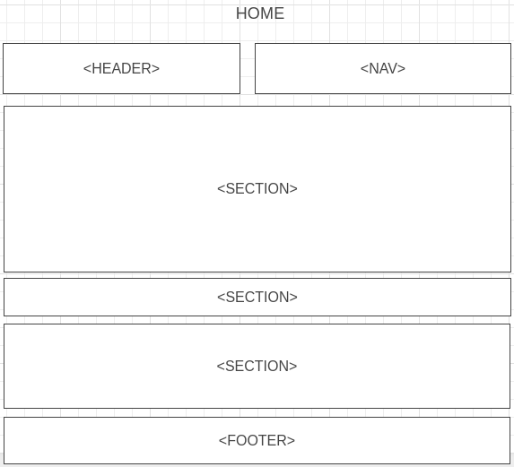
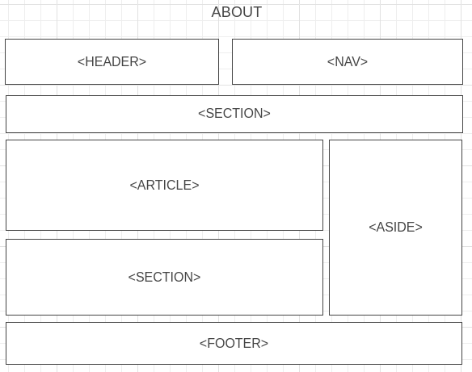
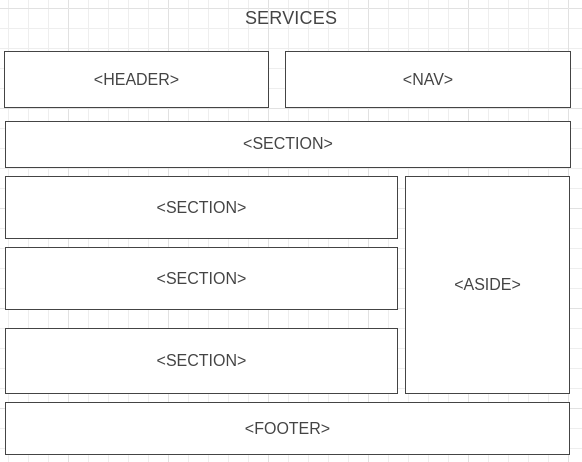

# Development Strategy

> `Acme-Web-Design Homepage`

This page contains basic information about the company which provides basic web-design services.

## Wireframe

<!-- include a wireframe for your project in this repository, and display it here -->
<!-- wireframe.cc is a good site for getting started with wireframes -->

## 0. Set-Up

__A User can see my initial repository and live demo__

### Repo

- Generate from Template
- Write initial, basic README
- Turn on GitHub Pages

## 1. User Story: HTML content for home page

__As a site visitor, I want to know what the web page is called__

### Branches

1. This user story was developed on a brach called `1-html-content`
1. It was merged to `master` when the feature was finished.

### HTML

- All the HTML elements will be added.

### CSS

- Boilerplate

---

## 2. User Story: Header and Nav

__As a site visitor, I want to see the name of the company and basic links.__

### Branches

1. This user story was developed on a brach called `2-header`
1. It was merged to `master` when the feature was finished.

### HTML

- A header element with the company name
- nav element

### CSS

Styling for the new elements

---

## 3. User Story: Showcase

__As a site visitor, I want to learn about the purpose of the company.__

### Branches

1. This user story was developed on a brach called `3-showcase`
1. It was merged to `master` when the feature was finished.

### HTML

- article element

### CSS

Styling for the new element

---

## 4. User Story: Newsletter

__As a site visitor, I want to know how to subscribe to the newsletter.__

### Branches

1. This user story was developed on a brach called `4-newsletter`
1. It was merged to `master` when the feature was finished.

### HTML

- section element
- form

### CSS

Styling for the new elements

---

## 5. User Story: Boxes

__As a site visitor, I want to know basic services provided by the company.__

### Branches

1. This user story was developed on a brach called `5-boxes`
1. It was merged to `master` when the feature was finished.

### HTML

- Section element

### CSS

- Box layout
- styling

---

## 6. User Story: Footer

__As a site visitor, I want to read copyright information about this web page__

### Branches

1. This user story was developed on a brach called `6-footer`
1. It was merged to `master` when the feature was finished.

### HTML

- footer element
- copyright information

### CSS

Styling for the new element

---

## 7. User Story: About page

__As a site visitor, I want to get the basic information about company__

### Branches

1. This user story was developed on a brach called `7-about-page`
1. It was merged to `master` when the feature was finished.

### HTML

- article element
- information about company

### CSS

Styling for the new element

---

## 8. User Story: Services page

__As a site visitor, I want to learn about services and pricing__

### Branches

1. This user story was developed on a brach called `8-services-page`
1. It was merged to `master` when the feature was finished.

### HTML

- article element
- aside element
- forms to get a quote

### CSS

Styling for the new element

---

## 9. User Story: Media queries

__As a site visitor, I want to be able see the page clearly on different platforms__

### Branches

1. This user story was developed on a brach called `9-media-queries`
1. It was merged to `master` when the feature was finished.

### CSS

Styling to have a responsive page

---

## Finishing Touches

- Write final, complete README
 
- Validate code to check for any last mistakes
